# 고랭(GORAENG)
Backend Engineer · Spec-driven Builder · Systems & AI Research

> I design and build systems from specs, and validate them through experiments and AI-driven automation.

---

## 🧭 Core focus

- Spec-driven development (reduce ambiguity → executable systems)
- Hypothesis-driven experimentation (validate before scaling)
- AI agent systems & automation pipelines
- Distributed systems & data processing
- Real-world decision systems (environment → action modeling)

---

## 🚀 Featured work

### System Engineering

#### [status-relay](https://github.com/neisii/status-relay)
PRD-driven macOS and windows system monitor
- AI-assisted development (PRD → implementation)
- Rust + Tauri desktop architecture
- State diff + notification pipeline

---

### AI / Agent Systems

#### LLM Learning Progression System
Multi-stage LLM capability framework
- [RAG over personal codebase (Spring AI + PgVector)](https://github.com/neisii/personal-rag)
- [Tool-using automation agents (CLI / function calling)](https://github.com/neisii/action-agent)
- [Multi-agent orchestration (LangGraph-style)](https://github.com/neisii/multi-agent-debate)
- [Recursive self-improving memory system](https://github.com/neisii/self-reflection-rag)

---

### Applied Decision Systems

#### [cycling-adviser](https://github.com/neisii/cycling-adviser) [(Backend)](https://github.com/neisii/weather-proxy)
Weather-based cycling outfit recommendation system
- Environmental condition → action decision modeling (weather → clothing)
- Rule-based + data-driven recommendation engine
- Real-time condition handling (temperature, wind, precipitation)
- Lightweight decision support system for cyclists

---

## 🛠 Tech snapshot

### Backend & Core

### Infra & Platform

### Frontend & App

### Secondary Languages

---

## 🌱 Current direction

AI agent systems · Data pipeline engineering · Automation-first backend design · Decision systems

---

## ✳️ Signal

Turning ambiguous real-world conditions into executable systems.

---
 
## 📊 Stats

